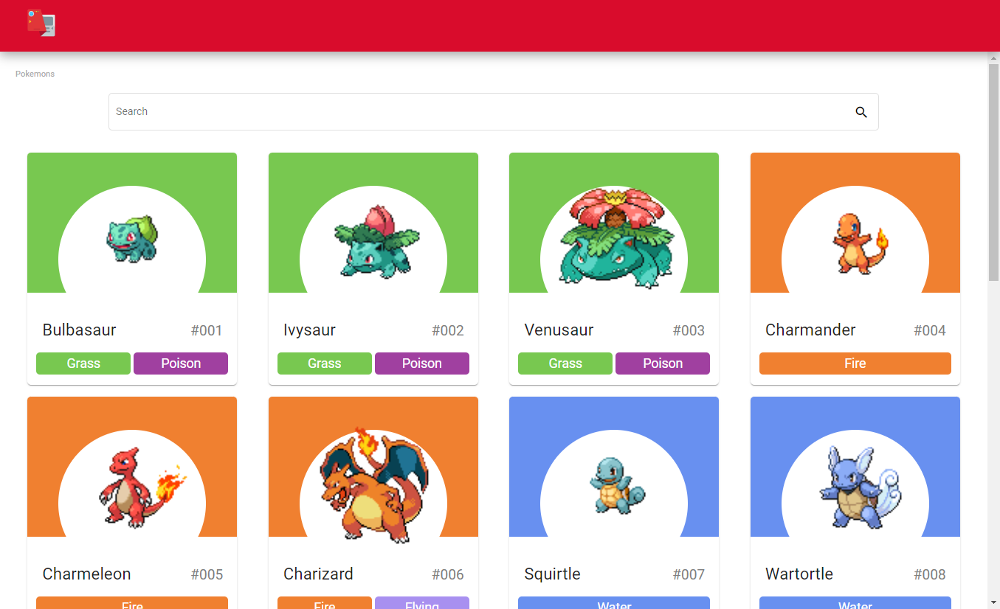
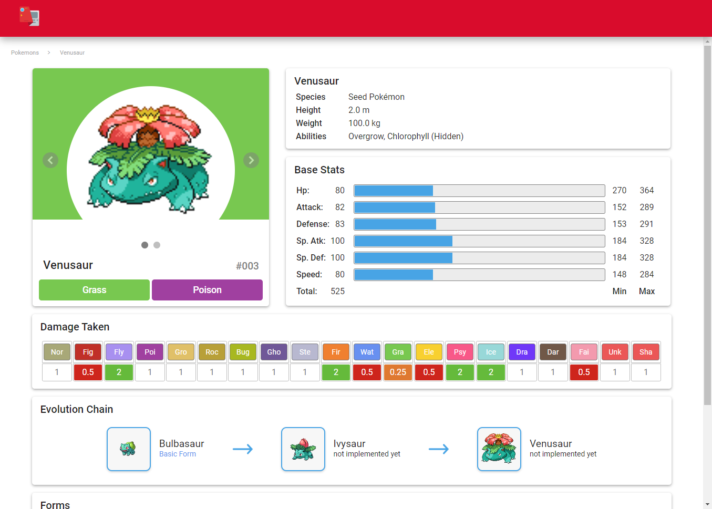

# AngularPokemonPokedex

O projeto da pokedex feito em angular veio da vontade de atualizar meu conhecimento em angular, e tambem fazer uma pagina que me auxilia-se enquanto eu jogava algum jogo relacionado a pokemon.

No projeto temos a pagina inicial painel de controle (Dashboard), onde uma lista de pokemons e tambem uma barra de pesquisa pode ser vista. Na barra de pesquisa tem-se a possibilidade de encontrar o pokemon apenas pelo seu nome.

A pagina de Painel de Controle pode ser vista a baixo:
<p align="center">  </p>

A pagina de detalhamento de pokemons, contem algumas propriedades dos pokemons e estas foram escolhidas tendo como base oque era necessario durante minhas noites de jogos com meus amigos. Na pagina em questão é possivel ver os seguintes recursos:

- Card com fotos do pokemon (Normal e Shiny).
- Card com algumas descrições chaves do pokemon.
- Card com os estatus base e maximo que o pokemon possui.
- Card com a tabela de tipo (Qual o tipo é efetivo).
- Card com a linha de evolução do Pokemon.

_Observação: Na linha de evolução do pokemon alguns recuros não foram implementados como esperado._

A pagina de Detalhes Pokemons pode ser vista a baixo:
<p align="center">  </p>

## Sobre o Projeto

No projeto foi utilizado:
 - [Typscript](https://www.typescriptlang.org/). Versão 4.7.2
 - [Angular](https://angular.io/). Versão 14.1
 - [Angular-Material](https://material.angular.io/). Versão 14.1
 - [RxJS](https://rxjs.dev/). Versão 7.5.0

## Configuração do Projeto

### Como gerar os arquivos para fazer publicação nas paginas do Github

Você deve executar o comando a seguir para gerar os arquivos necessarios para fazer a publicação do projeto.

```shell
ng build --output-path docs --base-href /angular-pokemon-pokedex/
```

_Observação: Você deve fazer uma copia do arquivo `index.hmtl` e renomea-lo para `404.html`._
